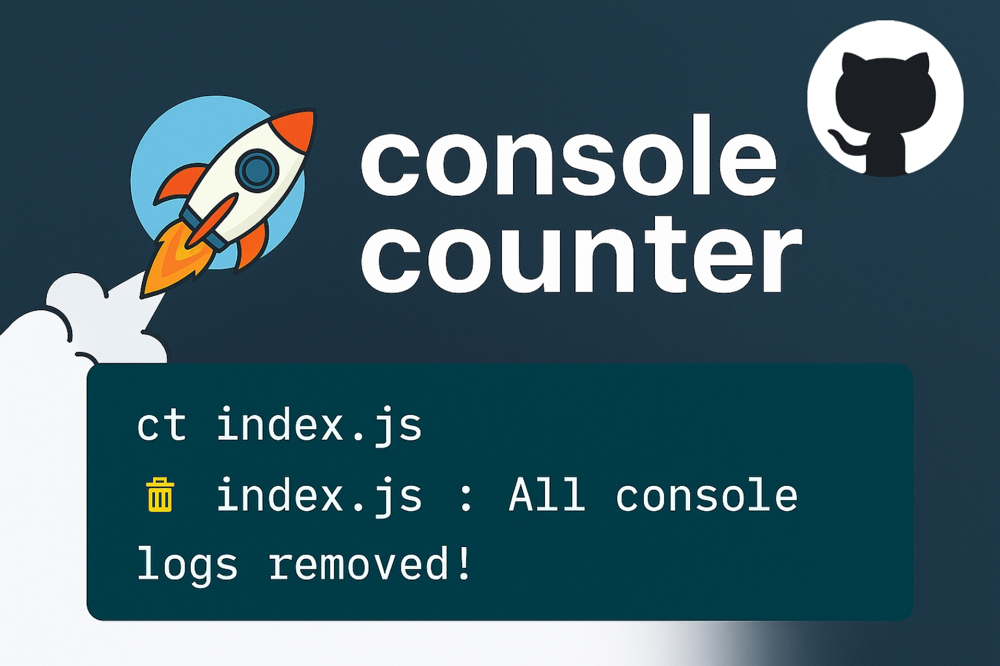

</h1>

<h1 align="center">
 Console Counter 📟
</h1>
Insert, count, and remove `console.log` statements automatically in JavaScript/TypeScript files — with instant keyboard shortcuts to keep your codebase clean and production-ready.

---

## 🚀 What is Console Counter?

**Console Counter** is a lightweight VS Code extension that helps you **count** and **remove** all `console` statements in your current file.  
No more manual searching or deleting logs — just one shortcut and you're done. ⚡

[](https://www.npmjs.com/package/console-debug-pro)
[](https://www.npmjs.com/package/console-debug-pro)
[](LICENSE)


---

## ✨ Features at a Glance

✔️ **Count Console Logs** – Instantly see how many `console` statements exist in the current file.  
✔️ **Remove All Console Logs** – Clean your file from all `console` statements in one shortcut.  
✔️ **File-Specific Context** – Results always show the file name for better clarity.  
✔️ **Smart Handling** – If no `console` statements are found, you get a friendly notification.  
✔️ **Keyboard Shortcuts** – Super quick commands for count and remove.

---


## 💻 Supported Frameworks

**Frontend:** React, Vue, Angular, Svelte, Next.js, Nuxt.js, Remix  
**Backend:** Node.js, Express, NestJS, Fastify, Koa, AdonisJS  
**Full-Stack:** Meteor, Blitz.js, Redwood.js


## 📦 Installation

Install globally using npm:

**Using npm:**
```bash
npm install -g console-counter

This will give you access to the commands ct and cr anywhere in your system.
```
_______________________________________________________________________________________

**🛠️ Usage:**
**1. Check Console Count**
```bash
ct <filename.js>

// Example:
ct index.js

// Output::
📟 Console Count: 1 : index.js

```
**2. Remove All Console Logs**
```bash
// Basic usage
cr <filename.js>

// Example:
cr index.js

// Output:---> 🧹 index.js : All console logs removed!

// Check Again After Removal:
ct index.js

// Output:---> 📟 Console Count: 0 : index.js

// When No Consoles Exist
ct app.js

// Output:
❌ No console logs found in app.js


---

## 🖼️ Example Outputs

- Counting consoles:  
  `📟 Console Count: 5 : PostPreview.jsx`

- Removing consoles:  
  `🧹 PostPreview.jsx : All console logs removed!`

- When no console logs exist:  
  `❌ No console logs found in PostPreview.jsx`

---

## 🔧 Configuration & Customization

Currently, Console Counter is **zero-config** — it works out of the box.  
In future updates, you’ll be able to:

✅ Customize which `console` methods to track (log, warn, error, etc.)  
✅ Change keyboard shortcuts  
✅ Ignore specific files/folders  

---

## 💼 Why Console Counter?

While debugging, `console.log` is your best friend — but in production, it’s your enemy.  
This extension helps you keep your project clean with **one tap** instead of manual cleanup. 🧹

---

## 📖 Changelog

### v0.0.1
- Initial release 🎉  
- Added count and remove features with shortcuts.  
- Smart notification when no consoles are found.

---

## 💙 Support

Console Counter is open-source and built with ❤️ for developers.  
If you enjoy using it, please ⭐ the repository and share it with your dev friends.  

---

## 📧 Contact

Feel free to reach out or follow me on these platforms:

| Platform        | Link |
|-----------------|------|
| 🌐 **GitHub**   | [github.com/codingyaari](https://github.com/codingyaari) |
| 📦 **NPM**      | [npmjs.com/~codingyaari](https://www.npmjs.com/~codingyaari) |
| 💬 **StackOverflow** | [stackoverflow.com/users/31368342/codingyaari](https://stackoverflow.com/users/31368342/codingyaari) |
| ▶️ **YouTube**  | [youtube.com/@codingyaari](https://www.youtube.com/@codingyaari) |
| 👍 **Facebook** | [facebook.com/profile.php?id=61579800007414](https://www.facebook.com/profile.php?id=61579800007414) |
| 📸 **Instagram**| [instagram.com/codingyaari](https://instagram.com/codingyaari) |
| 🐦 **X (Twitter)** | [x.com/codingyaari](https://x.com/codingyaari) |
| 📧 **Gmail**    | [codingyaari@gmail.com](mailto:codingyaari@gmail.com) |
---

## 📜 License

Released under the MIT License.  
Free to use for personal and commercial projects.


 ## 🤝 Contributing
 Contributions are always welcome!
 - If you'd like to make improvements, please create a Pull Request. For any bugs or feature requests, please create an Issue.
 
- **GitHub:** [Samyy-decod](https://github.com/Samyy-decod)
 _______________________________________________________________________________________
 ## 🧑‍💻 Author
- **GitHub:** [codingyaari](https://github.com/codingyaari)